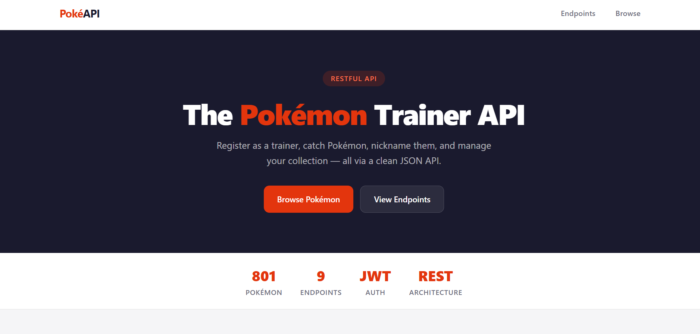
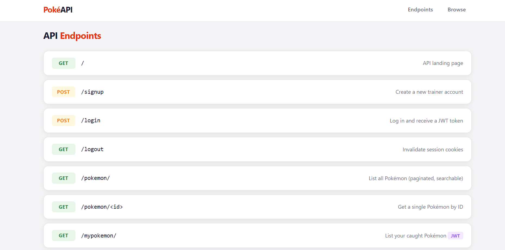
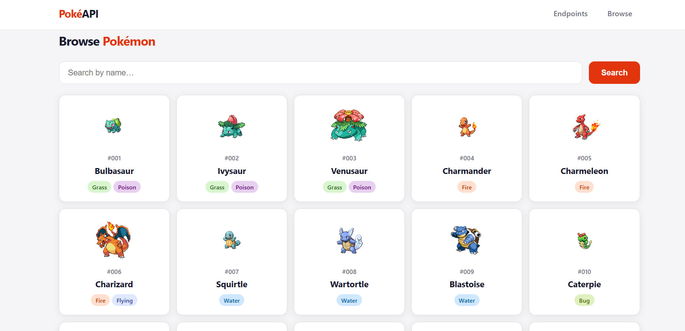
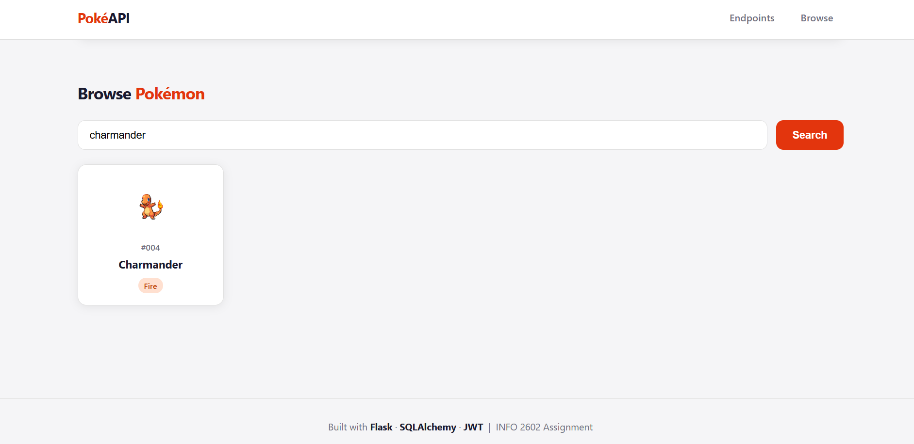

# PokéAPI — Pokémon Trainer REST API

A fully functional REST API built with **Flask**, **SQLAlchemy**, and **JWT authentication** that lets trainers register, log in, and manage their personal Pokémon collection. Built as part of the INFO 2602 Web Development course.

---

## Tech Stack

| Layer | Technology |
|---|---|
| Backend | Python 3.10 · Flask 3.0 |
| Database | SQLite (dev) via SQLAlchemy ORM |
| Authentication | JWT (flask-jwt-extended) |
| CORS | flask-cors |
| Testing | Postman / Newman |
| Data | 800+ Pokémon from official dataset |

---

## PokeAPI Website Screenshots






---

## Features

- **User Registration & Login** with bcrypt-hashed passwords and JWT tokens
- **Browse Pokémon** — paginated, searchable directory of 800+ Pokémon with full stats
- **Catch Pokémon** — add any Pokémon to your personal collection with a custom nickname
- **Manage Collection** — rename or release your caught Pokémon
- **Protected Endpoints** — JWT-based authorization on all collection routes
- **Interactive Frontend** — minimal, responsive web UI served directly from Flask
- **Full Postman Collection** — automated test suite covering all endpoints

---

## Project Structure

```
.
├── App/
│   ├── __init__.py        # Package exports
│   ├── app.py             # Flask app, routes, CLI commands
│   └── models.py          # SQLAlchemy models (User, Pokemon, UserPokemon)
├── templates/
│   └── index.html         # Frontend — served at GET /
├── wsgi.py                # Application entry point
├── pokemon.csv            # 800+ Pokémon seed data
├── collection.json        # Postman test collection
├── environment.json       # Postman environment (host variable)
├── requirements.txt       # Python dependencies
└── pyproject.toml         # Poetry configuration
```

---

## Getting Started

### 1. Install Dependencies

```bash
pip install -r requirements.txt
```

### 2. Initialize the Database

This creates all tables and seeds the database with 800+ Pokémon from `pokemon.csv`:

```bash
flask init
```

### 3. Run the Server

```bash
flask run
```

Or directly:

```bash
python wsgi.py
```

The API will be available at `http://localhost:8080`.

---

## API Reference

### Authentication

| Method | Endpoint | Description | Auth Required |
|---|---|---|---|
| `POST` | `/signup` | Register a new trainer | No |
| `POST` | `/login` | Log in and receive JWT | No |
| `GET` | `/logout` | Clear session cookies | No |

**Signup / Login Body:**
```json
{
  "username": "ash",
  "password": "pikachu123"
}
```

**Login Response:**
```json
{
  "token": "<jwt_token>",
  "user": { "id": 1, "username": "ash" }
}
```

---

### Pokémon Directory

| Method | Endpoint | Description | Auth Required |
|---|---|---|---|
| `GET` | `/pokemon/` | List all Pokémon (paginated) | No |
| `GET` | `/pokemon/?q=char` | Search by name | No |
| `GET` | `/pokemon/<id>` | Get a single Pokémon | No |

**Query Parameters for `/pokemon/`:**

| Param | Type | Default | Description |
|---|---|---|---|
| `page` | int | 1 | Page number |
| `per_page` | int | 20 | Results per page (max 100) |
| `q` | string | — | Name search filter |

---

### My Pokémon Collection

All routes require: `Authorization: Bearer <token>`

| Method | Endpoint | Description |
|---|---|---|
| `GET` | `/mypokemon/` | List your caught Pokémon |
| `POST` | `/mypokemon/` | Catch a Pokémon |
| `PUT` | `/mypokemon/` | Rename a caught Pokémon |
| `DELETE` | `/mypokemon/` | Release a Pokémon |

**Catch a Pokémon (`POST /mypokemon/`):**
```json
{
  "pokemon_id": 25,
  "name": "Sparky"
}
```

**Rename (`PUT /mypokemon/`):**
```json
{
  "id": 1,
  "name": "Thunderbolt"
}
```

**Release (`DELETE /mypokemon/`):**
```json
{
  "id": 1
}
```

---

## Running Tests

Make sure Newman is installed and the server is running, then:

```bash
npm test
```

This runs the full Postman collection against `http://127.0.0.1:8080`. See `POSTMAN_GUIDE.md` for a step-by-step walkthrough.

---

## Data Models

### User
| Field | Type | Notes |
|---|---|---|
| id | Integer | Primary key |
| username | String | Unique |
| password_hash | String | bcrypt hashed |

### Pokemon
| Field | Type | Notes |
|---|---|---|
| id | Integer | Pokédex number |
| name | String | Pokémon name |
| type1 | String | Primary type |
| type2 | String | Secondary type (nullable) |
| hp / attack / defense | Integer | Base stats |
| sp_attack / sp_defense / speed | Integer | Base stats |

### UserPokemon
| Field | Type | Notes |
|---|---|---|
| id | Integer | Primary key |
| user_id | FK → User | Owner |
| pokemon_id | FK → Pokemon | Which Pokémon |
| name | String | Custom nickname |

---

## Design Decisions

- **JWT via Authorization header** — More portable than cookies; works cleanly with Postman and any frontend framework.
- **SQLite for development** — Zero-config, portable. Swap `SQLALCHEMY_DATABASE_URI` for PostgreSQL in production.
- **CSV seeding** — All 800+ Pokémon are seeded in one `flask init` command, no external API calls needed.
- **Paginated responses** — The Pokémon list is paginated to keep response sizes manageable.